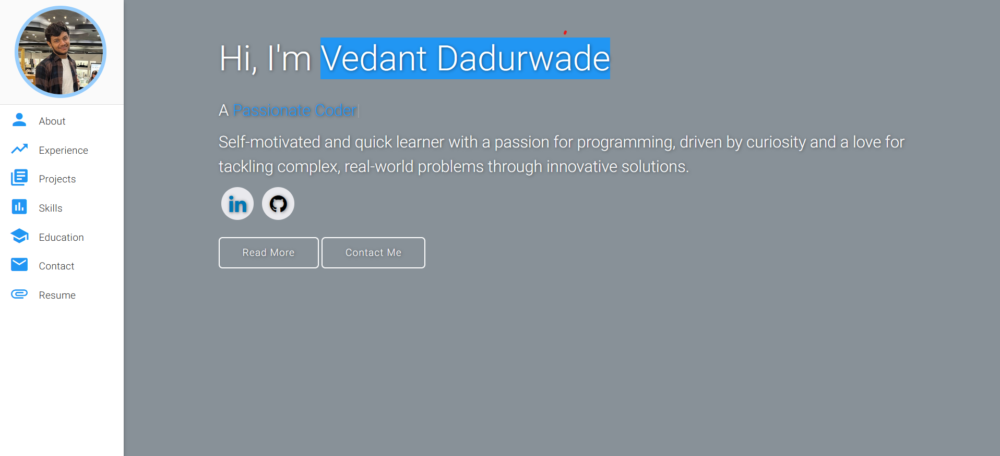

### Website Preview

 
  <kbd>
    
  </kbd>

## Sections 📚
✔️ About
✔️ Experience
✔️ Projects
✔️ Skills
✔️ Education
✔️ Contact
✔️ Resume

To view a live example, **[click here](https://vedantdadurwade.github.io/)**

## Tools Used 🛠️
* [<b>GitHub Pages</b>](https://create-react-app.dev/docs/deployment/#github-pages) - To host my static website (HTML, CSS, JS).
* [<b>Materialize</b>](https://materializecss.com/) - A CSS framework to get Google's Material Design components.
* [<b>Typed.js</b>](https://mattboldt.com/demos/typed-js/) - JavaScript Library